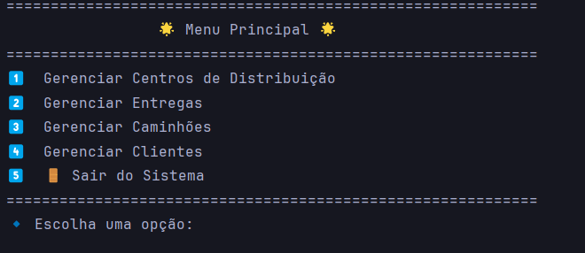
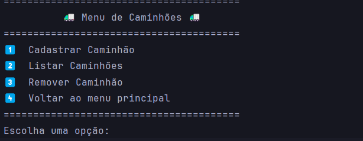
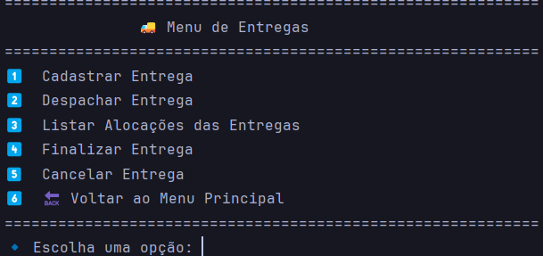
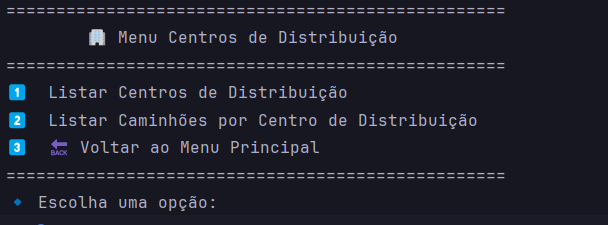

# 🚚 **EntregaAI - Otimização Logística com Múltiplos Centros de Distribuição**

Este projeto é uma solução algorítmica para otimizar o roteamento de entregas em uma empresa de logística com múltiplos centros de distribuição, minimizando custos e maximizando a eficiência operacional.

---

## 📋 **Objetivo**

- **Minimizar custos de transporte**, considerando tempo e distância percorrida.  
- **Alocar caminhões de forma eficiente**, com base na capacidade e disponibilidade.  
- **Garantir a entrega dentro do prazo estipulado.**  
- Determinar o **centro de distribuição mais próximo** para cada entrega.  

---

## 🛠️ **Funcionalidades**

1. **Cálculo de rotas mais curtas** utilizando algoritmos baseados em grafos.  
2. **Integração com APIs externas** para localização geográfica (OpenCage Geocoder).  
3. **Gestão de frota e entregas**, incluindo controle de capacidade e priorização.  
4. **Interface de visualização** com menus para gerenciamento de caminhões, clientes, entregas e centros de distribuição.  

---

## 🗂️ **Estrutura do Projeto**

```plaintext
📦 projeto-logistica
├── database/               # Configuração do banco de dados
│   ├── config.py          
│   └── init_db.py         
├── models/                 # Modelos do banco de dados
├── repository/             # Repositório de acesso ao banco de dados
│   └── banco_dados.py      
├── service/                # Serviços e regras de negócio
│   ├── cadastro.py         
│   └── sistema_logistico.py
├── util/                   # Funções utilitárias
│   ├── calcular_distancia.py 
│   └── encontrar_localizacao.py 
├── visual/                 # Interface com menus
└── README.md               # Documentação do projeto

```

## 🚀 Como Executar
- **Pré-requisitos**
- **Python 3.9+**
- **API Key do OpenCage Geocoder**
- **Banco de dados configurado (SQLite)**

## Instalação
1 - **Clone o repositório:**
```bash
git clone https://github.com/allanaavila/entregaAI.git
cd entregaAI
```

2 - **Instale as dependências:**
```bash
pip install -r requirements.txt
```

3 - **Configure as variáveis de ambiente:**
-**Crie um arquivo .env na raiz do projeto com as seguintes informações:**
```bash
OPENCAGE_API_KEY=your_api_key_here
NOMINATIM_USER_AGENT=your_user_agent_here
```

4 - **Inicialize o banco de dados:**
```bash
python -m database.init_db
```

## Execução
-**Para iniciar o sistema, execute o menu principal:**
```bash
python visual/menu_principal.py
```

## 📊 Demonstração
<div style="display: flex; justify-content: space-around;">
  <div>
    <strong>Menu Principal</strong><br>
    
  </div>
  <div>
    <strong>Menu Caminhões</strong><br>
    
  </div>
  <div>
    <strong>Menu Clientes</strong><br>
    
  </div>
</div>
<br>
<div style="display: flex; justify-content: space-around;">
  <div>
    <strong>Menu Entregas</strong><br>
    
  </div>
  <div>
    <strong>Menu Centros</strong><br>
    
  </div>
</div>


## 📝 Contribuição
**Contribuições são bem-vindas!**  
Relate bugs ou sugira melhorias abrindo uma issue.  
Envie pull requests para melhorias ou correções.

## 📫 Contato
**Autor:** Allana Ávila  
**Email:** allanac.avila@gmail.com


